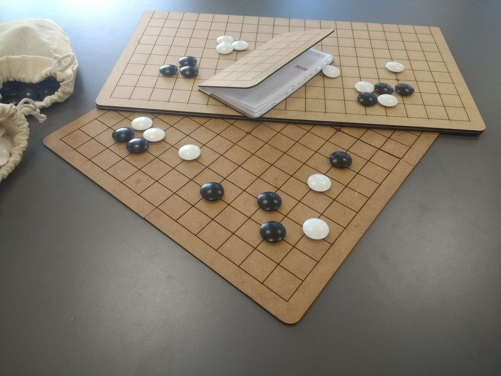
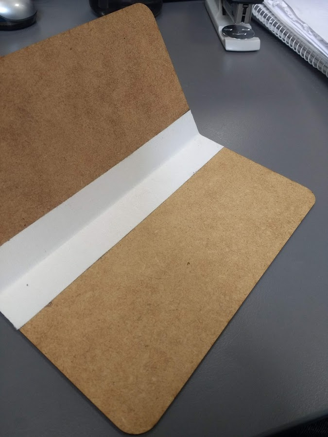

# Goban-svg #

[](https://actions-badge.atrox.dev/AndreasGerken/goban-svg/goto)

`goban.py` generates an svg file for a [go board](https://en.wikipedia.org/wiki/Go_\(game\)#Boards) or goban.
The resulting file is suitable to print your own board.
I used it on wood with a [laser cutter](http://en.wikipedia.org/wiki/Laser_cutting) to create beautiful handmade boards.
The bed of my laser cutter was too small for full boards, so I made half boards and taped them together for handy flip boards (`--half_board`).

Since laser cutters create very thin lines, I made the program to draw multiple lines next to each other to make it appear thicker. In the default options, two lines with 0.25mm spacing are drawn everywhere. Use the `--test` argument to find out which spacing works for you and adjust it in the options at the top of the code.

## Examples ##

I cut multiple boards, using this script. Here are some of them (7x7 calendar, 13x13 folding board, 19x19 folding board). The cuts of the 13x13 were to deep so that it cracked on one of the lines. Be careful.



The folding boards are hinged in the back with 'Tesa Eco Repair' tape from my local hardware store.



Here is an example svg of a 7x7 board.


## Usage ##

You will need svgwrite to use this program:

```bash
  pip install svgwrite
```

To use, simply run from the command line:

```bash
  python goban.py
```

To show the result you can use `eog goban.svg`.

### Arguments

There are a few command line arguments to modify the board.
Here's an example:

```bash
  python goban.py --size=19 --half_board
```

|Argument|Type|Description|
|-----------------------|-----|---------------------------------------------------------------------------------------------------------------|
| --size, -s        | str | Size of the go board to generate [7, 9, 13, 19]                                                                   |
| --margin, -m      | int | Margin from the board edge to the lines in mm                                                                     |
| --multlines  | int | Draw multiple lines which can be used for cleaner lasercuts                                                            |
| --multlines_spacing | float | Spacing between the lines when multiple lines are drawn                                                       |
| --rounded_corners | int |Radius of rounded corners in mm. 0 for no rounded corners.                                                         |
| --no_border       | set | Don't draw the border around the board                                                                            |
| --test            | 'lines', 'holes' | Create a test file for 'lines' or 'holes'. (Better explained in README)                              |
| --half_board      | set | Create only half of the board for flip boards, this can be useful for smaller laser cutter beds.                  |
| --output, -o      | str |Output file path                                                                                                   |
| --stone_holder_d  | int | With this option you can generate a grid with round holes instead of a normal board.(Better explained in README)  |

### Special modes

#### --test ['lines', 'holes']
In this mode, the board is not drawn according to the other arguments. Instead a small test file for holes or lines is created.

With the argument 'lines' different multi line spacings and amounts are tested to fit the lasercutter. The settings are printed in the console for reference and are stored in the global variable test_lines (around line 52).

With the argument 'holes' different sized holes are created for the overlay board. With this you can find good settings for stone_holder_d, which fit to your stones and material thickness. The settings are printed in the console for reference and are stored in the global variable test_holes (around line 55)

#### --stone_holder_d [int]
With this option you can generate a grid with round holes instead of a normal board.
This can be used as an overlay for a board to hold the stones when playing on a moving table during travels or so.
I use this to cut acrylic glass as an overlay.
The default is 0, so this mode is deactivated.
If you use it, holes with the given diameter are created instead of the goban.
